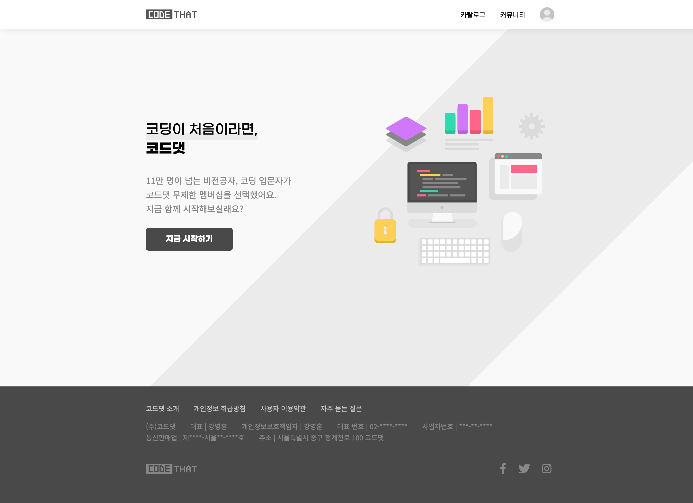

# Codethat | 기업 소개 사이트

> React 개발 기초 강의를 통해  
> React Router의 핵심 컴포넌트(Router, Routes, Route, Link)를 활용해 구현한 기업 소개 사이트입니다.

**배포 링크 (Netlify)**  
https://codethat-kujihye.netlify.app

---

## 주요 기능

- `React Router`를 활용한 SPA(Single Page Application) 라우팅 구현
- `Routes`와 `Route`를 이용한 페이지 구조 분리
- `Link`, `useNavigate`를 통한 페이지 이동
- `NavLink`를 활용한 활성(active) 스타일 적용
- 중첩 라우팅 및 `Outlet`을 활용한 레이아웃 분리
- `useParams`를 이용한 동적 라우팅 구현
- 잘못된 경로 접근 시 `와일드카드(*) 라우트` 및 `Navigate` 리다이렉트 처리
- `useSearchParams`를 활용한 검색

---

## 사용 기술

- React
- JavaScript (ES6+)
- HTML / CSS
